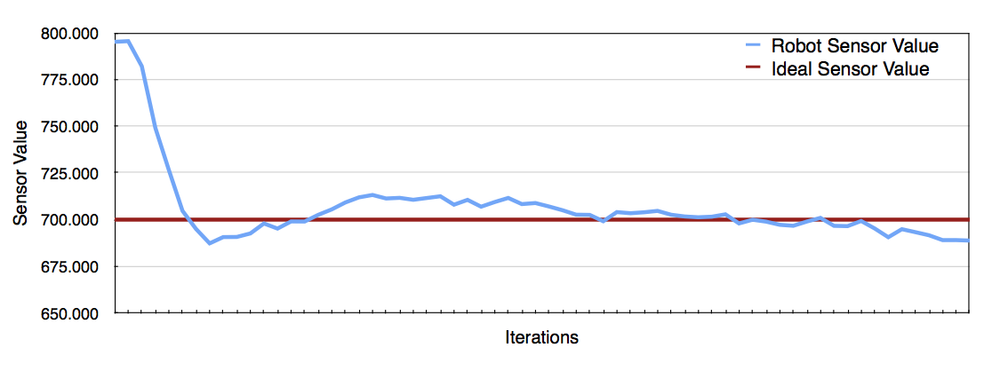
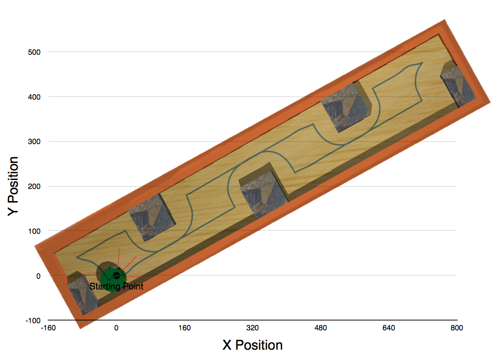
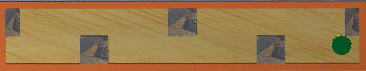
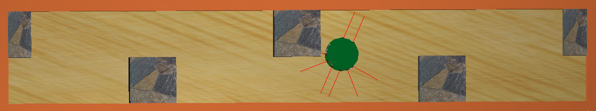
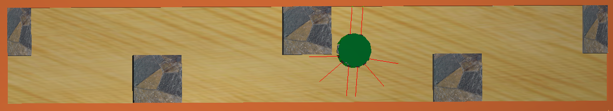
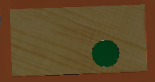
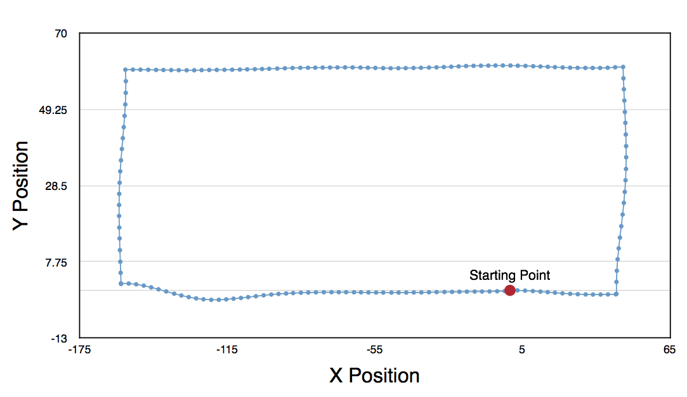

Introduction to Vision and Robotics 2014
======

*Mark Nemec, Milan Pavlik*

*s1140740, s1115104*


# 1 Introduction

## 1.1 The Task

The idea of the task is to design an algorithm to allow a Kephera robot to move through an environment while maintaining constant distance from the walls and avoid obstacles. The robot is required to carefully drive around the obstacles without hitting them. The robot continues following the walls until another obstacle is found. The robot should stop at the point of origin, that is the place where it originated (first started to follow a path).

The Kephera robot has two motors on each side of the robot as well as eight sensor positioned around the robot. The sensors can be used to retrieve the distances of objects around the robot.

## 1.2 Main Ideas

The main ideas used in the implementation are the following: *following a wall*, *avoiding obstacles* and *returning to the home location*.

Following a wall is based on the concept of a *Proportional Integral Derivative* (PID) controller where ideal situations are established and deviations from the ideal position are corrected for. Additionally, to the proportional error function, we also use the integral error (or cumulative error function) to influence the amount by which we correct for the ideal position error to speed the process. In essence, we do not use all the three parts of PID as the derivative component was not necessary.

In order to avoid obstacles in the path, we switch to a *rotate* mode where the wheels of the robot are set to rotate on the spot. The *rotate* mode is exited when the sensor provide sufficient evidence of having rotated enough. In the next stage the PID controller is restarted and following a wall is resumed.

Returning to the home location is done through relative odometry calculations. Initially, the relative location of the robot is zero on both axes and every action updates the internal representation of position. As the robot approaches its home location, the relative location will be approaching zero and the robot stops.

#2 Methods

## 2.1 PI Controller

The PI Controller is based on proportional error from an optimal point and factors in the cumulative error of previous actions.

Firstly, we select a set point `set_point` which represents the ideal reading of a sensor. Secondly, we compute the proportional part of the PI controller, to do this we find the offset of the current reading `current_reading` from the ideal value. Finally, we use a value of gain, `p_gain` to fine tune the proportional component.

```{.matlab}
p = (set_point - pv) * p_gain
```

Secondly, we keep track of the cumulative error function, that is the past errors and their corrections. The error function allows us to influence the action that needs to be executed next. For example, if the error is high, the turn action executed next should be faster than if the error were low. The current error can be computed similarly to the *proportional* component. Initially, we find the offset and multiply by integral gain constant `i_gain`.

```{.matlab}
ii = (set_point - pv) * i_gain
```

Next, the cumulative error is updated with the value of the *integral* component.

```
acum_error = acum_error + ii
```

Finally, the return value of the PI Controller becomes the sum of the cumulative error and the proportional.

```
out = p + acum_error
```

The resulting action will be stronger if the error is high and vice versa. The actions will eventually stabilise in an equilibrium until an obstacle or non-straight line object is found.

The values of *P_GAIN = 0.05;* was selected based on the following formula. Ideally we want the right sensor reading to be 700, setting the ideal position at 600 results in a 100 unit difference. We wanted to set the speed of 5 at that point so we set the P_GAIN to *0.05* to make it 5 when scaled down.

The value of *I_GAIN = 0.0002* was selected experimentally. It provides the ideal correction.

## 2.2 Wall following

Wall following is done using only one sensor, namely the sensor located at three o'clock of the robot. The robot only rotates one way and follows the wall on its right hand side.

Firstly, we obtain the distance readings from the sensors. The readings are saved into an array of `sensor_values`.

```{.matlab}
for i = 1 : SENSOR_COUNT
    sensor_values(i) = wb_distance_sensor_get_value(ps(i));
end
```

Secondly, we calculate the PI value of the sensor located at three o'clock of the robot given the ideal distance from the wall `DISTANCE_THRESH`, the proportional gain `P_GAIN` and the cumulative error gain `I_GAIN`. We also supply the current cumulative error value in order to update it inside the *pid* function.

```{.matlab}
[motors_pid, errors] = pid(sensor_values(6), distance_thresh, P_GAIN, I_GAIN, errors);
```

Thirdly, the speed on the right motor `vright` is calculated as the capped value of the `motors_pid` result between -10 and 10. The capping is important for maintaining reasonable speeds in situations where the cumulative error is large and the distance from the ideal position is large too. We take the negative value of the `motors_pid` value to reverse the relationship between sensor readings and actual distance. The implementation of Kephera returns large sensor readings when the robot is close while small values when it is far away.

```{.matlab}
vright = clamp(-motors_pid, -10, 10);
```

Next, we split the speed on the left motor and the right motor between total speed of 12. If the ideal speed is 6 on each motor when going straight, the distribution of speeds allows the robot to correct for non ideal distances from the wall.

For example, if the robot is far away from the wall and the sensor reads a value of 200, we will obtain a value smaller than 5 from `motors_pid`. This will result in the left motor getting a larger slice of the total speed and turn faster, brining the robot closer to the wall.

The distribution of speeds for each wheel is done with the following code:

```{.matlab}
vleft = 12 - abs(vright);
```

Finally, the motor speeds of the Kephera robot are updated:

```{.matlab}
wb_differential_wheels_set_speed(vleft, vright);
```

## 2.3 Obstacle Avoidance

Obstacle avoidance requires the PI results to be overridden as PI is not suitable for obstacle avoidance. When avoiding an obstacle, the controller switches into a `turning` mode where it will rotate on the spot to the left until the sensor readings indicate that a turn has been made and it is okay to switch back to line following mode. In the implementation, this is done with nested if statements.

### 2.3.1 Detecting obstacles

In order to detect an obstacle in front of the robot, we use two sensors located at the front of the robot. If an obstacle closer to a threshold is detected, the robot switches into a *turn* mode, indicated by the `is_turning` flag, and begins rotating left on the spot.

```{.matlab}
if sensor_values(4) > 670 & sensor_values(3) > 670
    is_turning = true;
    turn_distance = sensor_values(4);
    vleft = -3;
    vright = 3;
```

### 2.3.2 Rotations

When the robot is in the *turning* mode, the robot will keep rotating until the sensor located on the right hand side at two o'clock is below a threshold of 400. The mode is switched back to *follow a line* and the errors collected for the PID are re-set.

```{.matlab}
if is_turning
    if sensor_values(5) <= 400
        is_turning = false;
        errors = 0;
        ...
    else
        vleft = -3;
        vright = 3;
    end
```

We have made the decision to go with values of 3 and -3 through experimentations.

## 2.4 Odometry

Using odometry with the Kepehera robots requires the use of encoders as the simulator environment attempts to model real world conditions and accounts for wheel slippage.

Firstly, we enable the use of encoders, passing in the *TIME_STAMP*.

```{.matlab}
wb_differential_wheels_enable_encoders(TIME_STEP);
```

Secondly, we retrieve the encoder values and convert them to the number of revolutions. The revolutions are then converted to millimeters to be consistent with the rest of the units in the implementation.

```{.matlab}
encoder_values = [wb_differential_wheels_get_left_encoder() wb_differential_wheels_get_right_encoder()];
encoder_values = encoder_values / (2 * 100.0 * pi);
encoder_values = encoder_values * 2 * pi * WHEEL_RADIUS;
```

Thirdly, we calculate relative position changes and update our internal coordinate system with the *x*, *y* and *angle* values.

```{.matlab}
x = x + 0.5 * (encoder_values(1) + encoder_values(2)) * cos(theta);
y = y + 0.5 * (encoder_values(1) + encoder_values(2)) * sin(theta);
theta = theta - 0.5 * (encoder_values(1) - encoder_values(2)) / (ROBOT_RADIUS);
```

To determine the *home location*, it is sufficient to check that the *x* and *y* coordinates are within a threshold - we use 3 millimeters.

```{.matlab}
if abs(x) < 3 & abs(y) < 3 & ready_to_stop
    wb_differential_wheels_set_speed(0, 0);
    ...
else
    % Mark the location as ready_to_stop
    ...
end
```

## 2.5 Thresholds

Majority of the thresholds used in the implementation were selected through experimentation. In order to make our thresholding easier, we limited ourselves to one threshold at a time, only adding the next once fairly good values have been obtained.

# 3 Results

## 3.1 Distance Control

The implementation aims to keep a constant distance from the walls. The ideal value for the sensor reading is set to be 700 which the robot to fit in spaces enclosed with 3 sides. In order to test how well the robot is able to find the equilibrium distance from the wall. The PI controller causes the distance from the wall to fluctuate and converge to the equilibrium page.

The image below shows how the robot stabilizes its position relative to the wall as it runs straight. There are still fluctuations, but the values are getting progressively smoother.



\newpage

The robot is able to maintain the distance from the wall fairly well. There are deviations but the overall movement is smooth. The image shows the movements of the robot on the image. The robot initially moves right and forward.



The lines merge together as there is one very narrow path around the obstacles and the same path is taken when going both ways.

The robot does not have any issues when approaching, entering and leaving the corner points of the world. This is due to the carefully selected value of distance threshold of 700 which allows it to stay in the middle the walls leaving enough room for maneuverability.

The robot would run into issues if the space required to 'park' the robot would be close to the width of the robot and the sensor distance threshold. A solution for this problem would to use sensors on the other side and 'verify' that the robot can possibly fit.

\newpage

## 3.2 Obstacle Avoidance

Generally, the robot is able to avoid all convex obstacles. In a couple of instances the robot crashes into the corner of the obstacle. This, however, only occurs in couple of instances. The image below shows a case where the robot may get stuck.



A possible solution to this problem is better fine tuning of the parameters and using multiple sensors.

Additionally, when avoiding an obstacle the robot may overturn slightly, this could be improved through better sensor reading. The images below show this case.





On the second image, the robot has gone too far and will not attempt to find the wall again in a jerky motion. This could be improved through a faster update of the sensor values.

\newpage

## 3.3 Returning home

The robot is returning to the point of origin reliably. The threshold of 3 millimeters seems to be satisfactory. We have had one case where the robot did not stop at the point of origin because the displacement in both *x* and *y* was greater than 3. However, this only a single occurence and we were not able to reproduce it. Below is a picture of an example environment that we tested odometry on and a scatter plot of *x* and *y* positions relative to the origin.





\newpage

# 4 Discussion

## 4.1 Future Improvements

We think that the algorithms that we developed are reasonably successful in obstacle avoidance, wall following and odometry. There are few ideas that we would have liked to explore given more time:

- Use all of the sensors for more fluid and accurate wall following and movement in general. Currently, our robot's movement are a little bit jerky when it goes around the corner. This could be improved by careful thresholding of all of the sensor values.

- Try porting our code to the real Khepera robot. We have not implemented a version that works with the real robots but we think making our code work with it would not require much more effort.

- Use the derivative term of the PID controller. Currently, we only use the proportional and integral terms. This works pretty well, however with the derivative term we could improve the settiling time and stability of the robot.

## 4.2 Work distribution

We have worked on the assignment together. The work distribution should be 50:50.
